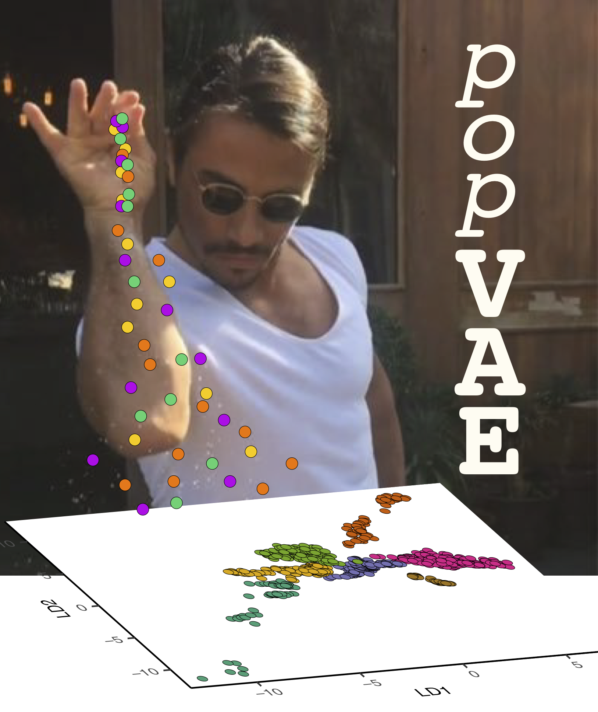

Dimensionality reduction for population genetic data with a Variational Autoencoder (VAE). 

# Overview
popVAE fits a VAE to a set up input genotypes. This is essentially a pair of neural networks which seek to first compress an individual's genotype to a location in an n-dimensional latent space and then to recreate the input data. We call the network that translates genotypes to latent space coordinates the "encoder", and the network that translates latent space coordinates back to a genotype vector the "decoder".  Here's a figure describing the basic setup: 


By passing genotypes to a trained encoder we can visualize the distribution of samples in latent space -- like a PCA, but with a user-defined number of dimensions and using a completely nonlinear framework. Similarly by passing coordinates to the decoder we can create new artificial genotypes characteristic of a given sample or population.

# Install
The `setup.py` script should take care of all dependencies for you. Clone this repo then install with 
`python setup.py install`

# Run
popVAE requires input genotypes in .vcf, .vcf.gz, or .zarr formats. This repo includes a test dataset of around 1,000 genome-wide SNPs from migratory Painted Buntings (from this paper: http://cjbattey.com/papers/pabu_amnat_final.pdf). Fit a model to this data with: 
  
  ```popvae.py --infile data/pabu/pabu_test_genotypes.vcf --out out/pabu_test --seed 42```

This model should fit in less than a minute on a regular laptop CPU. For running on larger datasets we strongly recommend using a CUDA-enabled GPU (typically 5 - 100x faster).

Many hyperparameters and filtering options can be adjusted at the command line.
Run `popvae.py --h` to see all parameters. One particularly useful option is `--PCA`, which will 
fit a PCA to your data as well as the VAE. If your VAE latent space makes no sense but the PCA does, try increasing the `--patience` parameter or running a grid search on network sizes with `--search_network_sizes`. 

# Output
At default settings popvae will output 4 files:    
`pabu_test_latent_coords.txt` --  coordinates for all samples in latent space.  
`pabu_test_history.txt` -- training and validation loss by epoch.  
`pabu_test_history.pdf` -- a plot of training and validation loss by epoch.  
`pabu_test_training_preds.txt` -- estimated latent coordinates output during model training, stored every `--prediction_freq` epochs.   

# Validation and plotting
Plot popVAE's latent_coords output just like a genotype PCA. For the test data a simple scatter plot can be produced in R with:  
``` 
library(ggplot2);library(data.table)
setwd("~/popvae/")
theme_set(theme_classic())

#load data
pd <- fread("out/pabu_test_latent_coords.txt",header=T)
names(pd)[1:2] <- c("LD1","LD2")
sd <- fread("data/pabu/pabu_test_sample_data.csv") #this has sample metadata for interpreting plots

#merge tables
pd <- merge(pd,sd,by="sampleID")

#plot VAE
ggplot(data=pd,aes(x=LD1,y=LD2,col=Longitude))+
  geom_point()
```
It should look something like this:  


Note there are two main groups of samples corresponding to eastern and western sampling localities, as well as group of slighlty intermediate samples in the western group. For this dataset these are allopatric (the big gap) and parapatric (the cline in western samples) breeding populations with different migratory strategies (see http://cjbattey.com/papers/pabu_amnat_final.pdf to compare these results with PCA and STRUCTURE). 

# Generating Artificial Genotypes
We're still working on the best way to allow users to generate artificial genotypes from trained models, since this tends to be a more interactive task than just fitting the model and visualizing the latent space. For now we have included a working example of fitting a VAE, generating artificial genotypes, and analyzing them with PCA and Admixture clustering at `scripts/popvae_decoder_HGDP_tests.py`. Stay tuned for updates. 

# Pronunciation Guide




