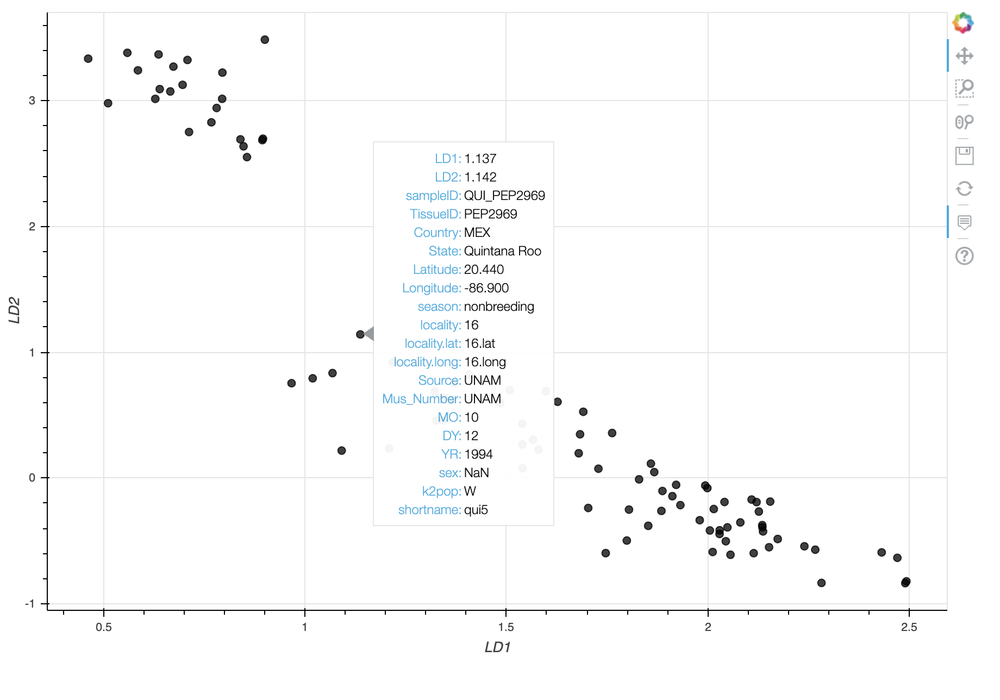
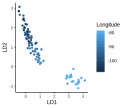

<p align="center">
  
</p>

# Summary
popVAE fits a variational autoencoder (VAE) and outputs the latent space.

A manuscript describing popVAE's methods and testing it on several empirical datasets can be found at: ?coming soon?

# Install
Popvae requires python 3.7 and tensorflow 1.15. We recommend you run in a new environment. 

Clone this repo and install with: 
```
conda create --name popvae python=3.7.7
git clone https://github.com/cjbattey/popvae.git
cd popvae
python setup.py install
```

# Run
popVAE requires input genotypes in .vcf, .vcf.gz, or .zarr formats. This repo includes a small test dataset of ddRADseq genotypes from migratory Painted Buntings (from this paper: http://cjbattey.com/papers/pabu_amnat_final.pdf). Fit a model with: 
  
  ```popvae.py --infile data/pabu/pabu_test_genotypes.vcf --out out/pabu_test --seed 42```

It should fit in less than a minute on a regular laptop CPU. For running on larger datasets we recommend using a CUDA-enabled GPU.

# Output
At default settings popvae will output 4 files:    
`pabu_test_latent_coords.txt` --  best-fit latent space coordinates by sample.  
`pabu_test_history.txt` -- training and validation loss by epoch.  
`pabu_test_history.pdf` -- a plot of training and validation loss by epoch.  
`pabu_test_training_preds.txt` -- latent coordinates output during model training, stored every `--prediction_freq` epochs.   

# Parameters
Many hyperparameters and filtering options can be adjusted at the command line.
Run `popvae.py --h` to see all parameters. 

Default settings work well on most datasets, but validation loss can usually be improved by tuning hyperparameters. We've seen most effects from changing three settings: network size, early stopping patience, and the proportion of samples used for model training versus validation. 

`--search_network_sizes` runs short optimizations for a range of network sizes and selects the network with lowest validation loss. Alternately, `--depth` and `--width` set the number of layers and the number of hidden units per layer in the network. If you're running low on GPU memory, reducing `--width` will help. 

`--patience` sets the number of epochs the optimizer will run after the last improvement in validation loss -- we've found that increasing this value (to, say, 300) sometimes helps with small datasets. 

`--train_prop` sets the proportion of samples used for model training, with the rest used for validation. 

To run a grid search over a specific set of network sizes with increased patience and a larger validation set on the test data, use: 
```
popvae.py --infile data/pabu/pabu_test_genotypes.vcf \
--out out/pabu_test --seed 42 --patience 300 \
--search_network_sizes --width_range 32,256,512 \
--depth_range 3,5,8 --train_prop 0.75
```

# Plotting
Using the optional `--plot` and `--metadata` options will generate an interactive scatterplot with metadata for each sample visible on mouseover. Running the test data with

```popvae.py --infile data/pabu/pabu_test_genotypes.vcf --out out/pabu_test --seed 42 --plot --metadata data/pabu/pabu_test_sample_data.txt```

Should cause a plot like this to open in your default web browser: 
<p align="center">
  
</p>

You can (slightly) customize this plot with the `plotvae.py` script. See options with `python scripts/plotvae.py --h`. 

Alternately, simple scatter plots can be produced in R with:  
``` 
library(ggplot2);library(data.table)
setwd("~/popvae/")
theme_set(theme_classic())

#load data
pd <- fread("out/pabu_test_latent_coords.txt",header=T)
names(pd)[1:2] <- c("LD1","LD2")
sd <- fread("data/pabu/pabu_test_sample_data.csv") #this has sample metadata for interpreting plots

#merge tables
pd <- merge(pd,sd,by="sampleID")

#plot VAE
ggplot(data=pd,aes(x=LD1,y=LD2,col=Longitude))+
  geom_point()
```

<p align="center">
  
</p>

Note there are two main groups of samples corresponding to eastern and western sampling localities, as well as cline within the western group. These are allopatric (the big gap) and parapatric (the cline in western samples) breeding populations with different migratory strategies (see http://cjbattey.com/papers/pabu_amnat_final.pdf to compare these results with PCA and STRUCTURE). 

# Generating Artificial Genotypes
We're still working on the best way to allow users to generate artificial genotypes from trained models, since this tends to be a more interactive task than just fitting the model and visualizing the latent space. For now we have included a working example of fitting a VAE, generating artificial genotypes, and analyzing them with PCA and Admixture clustering at `scripts/popvae_decoder_HGDP_tests.py`. Stay tuned for updates. 


